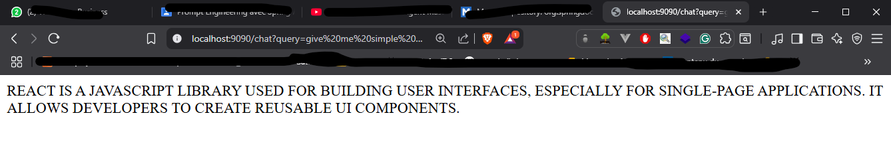
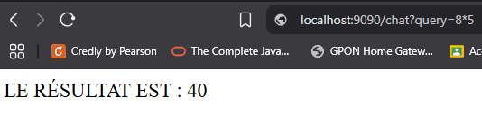
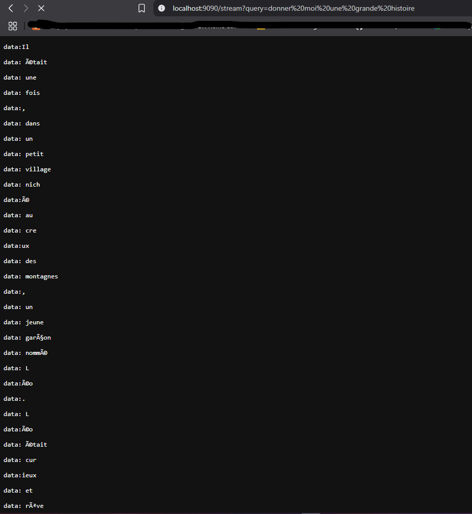
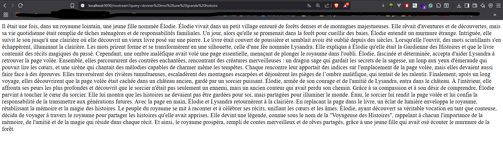
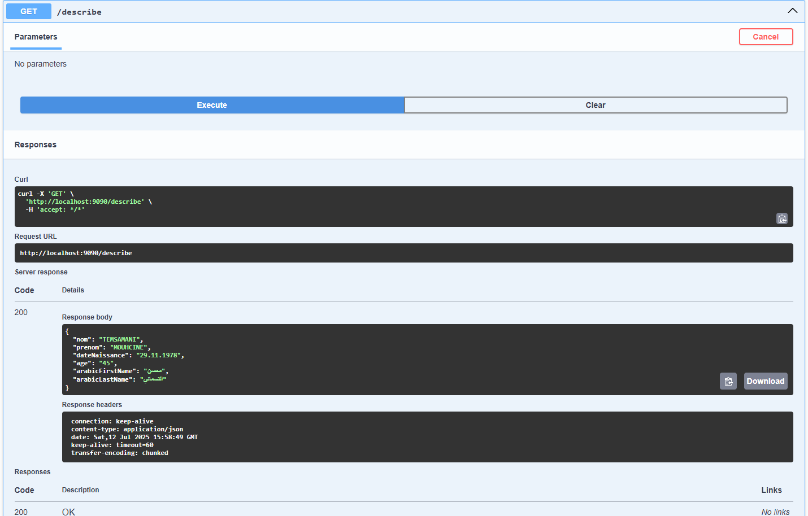
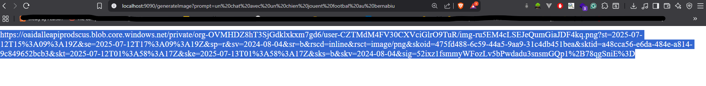
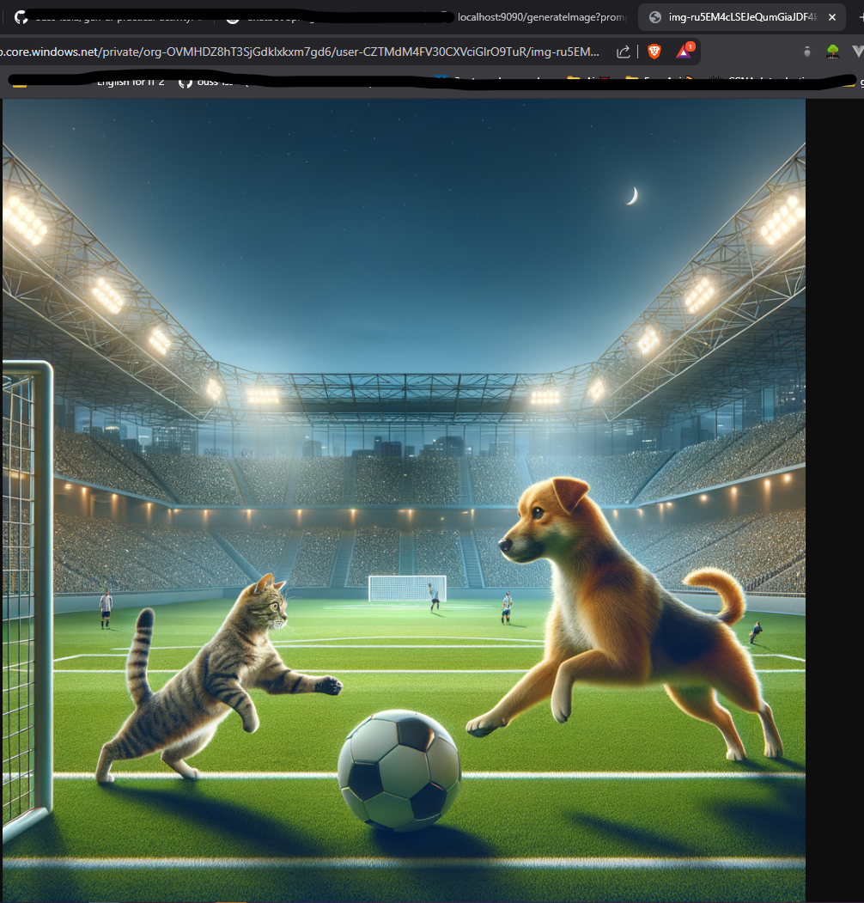

# 🤖 TP – Prompt Engineering avec Spring AI (OpenAI)

Ce projet est une **activité pratique** du module **Prompt Engineering**, visant à expérimenter les capacités de **Spring AI** en intégrant les modèles d’**OpenAI** (comme **GPT-4o**) au sein d’un projet Spring Boot.

> 🎓 Activité encadrée par **Mr YOUSSFI Mohamed**  
> 🎥 Vidéo de démonstration : [https://www.youtube.com/watch?v=mCt2o06yn1Q](https://www.youtube.com/watch?v=mCt2o06yn1Q)

---

## 🎯 Objectif de l'activité

- Comprendre et appliquer les concepts de **Prompt Engineering**.
- Créer un projet Spring Boot simple intégrant **Spring AI**.
- Utiliser les modèles **GPT-4o** et **DALL·E** via l’API d’OpenAI.
- Explorer plusieurs cas d’usage à travers différents contrôleurs.

---

## 🧠 Cas d’usage implémentés

L'application contient **5 contrôleurs**, chacun illustrant un aspect différent du Prompt Engineering avec Spring AI :

| Contrôleur | Fonctionnalité |
|------------|----------------|
| `AiAgentController` | Chatbot conversationnel basé sur GPT-4o. |
| `AiGenStructuredController` | Génération structurée (JSON, tableaux, formats précis). |
| `MultiModalController` | Interaction multimodale (texte + image). |
| `StreamingController` | Réponses IA en streaming (texte généré en flux). |
| `ImageGenerationController` | Génération d’images à partir d’un prompt texte (DALL·E). |

---

## ⚙️ Technologies utilisées

- **Java 17+**
- **Spring Boot 3.x**
- **Spring AI (OpenAI Starter)**
- **Lombok**
- **H2 (si besoin)**
- **Maven**

---

## 🔐 Configuration OpenAI

Dans le fichier `application.properties` :

```properties
# Clé API OpenAI (à NE PAS partager publiquement)
spring.ai.openai.api-key=sk-xxxxxxx

# Modèles utilisés
spring.ai.openai.chat.options.model=gpt-4o
spring.ai.openai.image.options.model=dall-e-3
```


## ▶️ Instructions d’exécution

1. **Cloner le projet** :
   ```bash
   git clone https://github.com/ouss-issib/gen-ai-practical-activity.git
   cd gen-ai-practical-activity

2. **Installer les dependences Flutter** :
   ```bash
   mvn clean install
   mvn spring-boot:run

3. **Tester les endpoints avec Postman ou curl** :
 --> curl -X GET http://localhost:9090/chat?query=bonjour


## 📸 Captures d’écran

| Zero Shot prompt Question | Zero Shot prompt Response | withMessages | askAgent |
|---|---|---|---|
|   |  |  | |

| Strem | No Stream | Multi Modal Agent |
|---|---|---|
|  |  |  |

| Strem | No Stream | 
|---|---|
|  |  |

| generated Url Image | Image Generated | 
|---|---|
|  |  |
